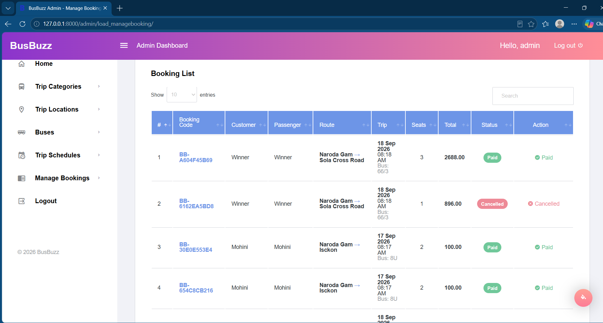
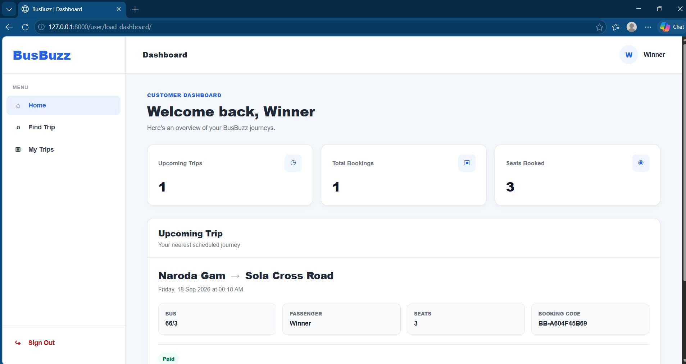
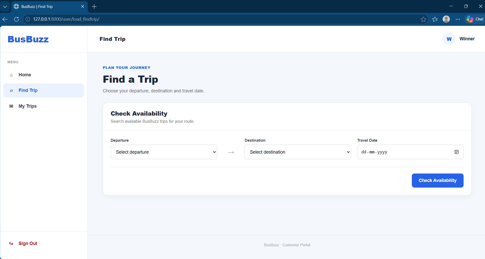
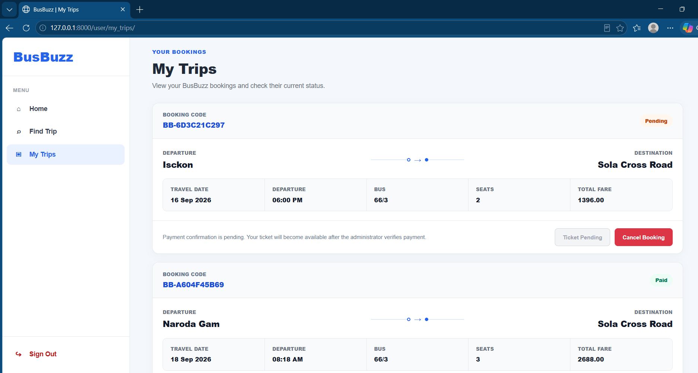
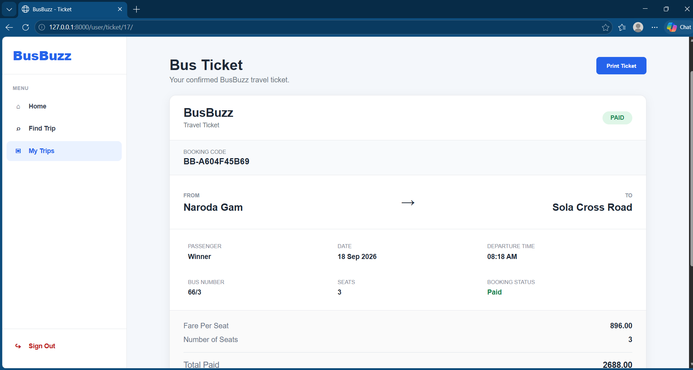

# 🚌 BusBuzz

BusBuzz is a Django-based bus reservation management system that provides separate customer and administrator workflows for searching scheduled trips, managing seat availability, creating reservations, processing booking status, and issuing tickets.

The project focuses on booking integrity, role-based access control, seat-capacity management, and a structured reservation lifecycle.

---

## 📌 Overview

BusBuzz provides two primary interfaces:

### Customer

Customers can:

- Create an account and sign in
- Search for trips by departure location, destination, and date
- View available schedules and remaining seats
- Reserve seats for a scheduled trip
- View reservations through **My Trips**
- Cancel eligible pending reservations
- View and print tickets after payment is confirmed

### Administrator

Administrators can:

- Manage trip categories
- Manage locations
- Manage buses
- Create and maintain trip schedules
- Review customer bookings
- Mark verified bookings as paid
- Monitor booking and operational information through the admin dashboard

---

## 🎯 Problem It Solves

A bus reservation system requires more than simply storing booking records. The application must coordinate schedules, buses, locations, customers, seat capacity, and booking states while preventing invalid reservations.

BusBuzz addresses these requirements through a centralized reservation workflow.

The system includes safeguards for:

- Preventing reservations beyond available bus capacity
- Limiting a customer to a maximum of **4 seats per schedule**
- Restricting customers to their own reservations
- Separating administrator and customer permissions
- Releasing seats when eligible reservations are cancelled
- Restricting ticket access until a booking is marked as paid
- Protecting booking creation using database transactions

---

## ✨ Core Features

### 🔎 Trip Search

Customers can search scheduled trips using:

- Departure location
- Destination location
- Travel date

The application performs an exact search against active schedules and validates invalid searches such as identical departure and destination locations.

### 🎟️ Reservation Management

BusBuzz maintains a booking lifecycle:

```text
Trip Search
    ↓
Select Schedule
    ↓
Check Seat Availability
    ↓
Create Reservation
    ↓
Pending
    ↓
Administrator Verification
    ↓
Paid
    ↓
Ticket Available
```

Customers can also cancel eligible pending reservations, returning those seats to availability.

### 🪑 Seat Availability Protection

The reservation workflow checks current seat usage before creating a booking.

Pending and paid reservations occupy seats, while cancelled reservations no longer reduce availability.

Booking creation also uses database transaction handling to help protect reservation integrity when seat availability is being updated.

### 🔐 Role-Based Access

BusBuzz uses Django authentication and groups to separate:

```text
Administrator
Customer
```

Administrator views are protected from customer accounts, while customer booking operations enforce authenticated-user ownership.

### 📊 Admin Dashboard

The administrator dashboard provides operational information including:

- New bookings today
- Departures today
- Active routes
- Active buses
- Paid revenue
- Seats booked
- Latest bookings
- Upcoming departures
- Customer count
- Pending bookings
- Paid bookings
- Cancelled bookings
- Bookings requiring administrator attention

---

## 🛠️ Technology Stack

| Area | Technology |
|---|---|
| Backend | Python, Django |
| Database | MySQL |
| ORM | Django ORM |
| Authentication | Django Authentication & Groups |
| Frontend | HTML, CSS, JavaScript |
| UI | Bootstrap-based responsive admin/customer interface |
| Configuration | Python `configparser` |
| Version Control | Git & GitHub |

### Current Core Dependencies

```text
Django==5.2.13
django-filter==25.2
mysqlclient==2.2.4
```

---

## 🏗️ Application Architecture

BusBuzz follows Django's Model-Template-View architecture.

```text
Browser
   │
   ▼
Django URL Routing
   │
   ▼
Views / Business Logic
   │
   ├── Authentication & Authorization
   ├── Trip Search
   ├── Booking Validation
   ├── Seat Availability
   └── Booking Status Management
   │
   ▼
Django ORM
   │
   ▼
MySQL Database
```

The application separates administrator operations from customer reservation workflows while sharing the same underlying schedule and booking data.

---

## 🗃️ Main Data Model

The primary application entities are:

```text
Categories
    │
    ▼
Buses
    │
    ▼
Schedules
   /   \
  /     \
Locations Bookings
            │
            ▼
          Users
```

### Main Models

- `CategoriesVO` — bus/trip category information
- `LocationsVO` — departure and destination locations
- `BusesVO` — bus information and seating capacity
- `ScheduleVO` — scheduled trips, routes, dates, fares, and buses
- `BookingsVO` — customer reservations and booking status
- Django `User` — authentication and customer ownership

---

## 🔄 Booking Status

BusBuzz V1 uses three primary booking states:

| Status | Meaning |
|---|---|
| Pending | Reservation created and awaiting administrator verification |
| Paid | Payment has been verified by the administrator |
| Cancelled | Reservation cancelled and seats released |

Only **Pending + Paid** bookings occupy seats.

Tickets are available only for bookings with **Paid** status.

---

## 🔒 Security & Data Integrity

BusBuzz V1 includes several security and integrity controls:

- Django session-based authentication
- Django Group-based authorization
- Protected administrator views
- Customer booking ownership validation
- Server-side seat-limit validation
- Seat-capacity validation
- Database transaction handling during reservation creation
- Paid-only ticket access
- Sensitive local configuration excluded from Git
- Example configuration provided without credentials

Secrets and local database credentials are intentionally not stored in the repository.

---

## 📁 Project Structure

```text
BusBuzz/
│
├── base/
│   ├── migrations/
│   ├── models.py
│   ├── decorators.py
│   ├── login_view.py
│   ├── index_view.py
│   ├── categories_view.py
│   ├── location_view.py
│   ├── bus_view.py
│   ├── schedule_view.py
│   ├── booking_view.py
│   ├── user_findtrip_view.py
│   └── urls.py
│
├── project/
│   ├── settings.py
│   ├── urls.py
│   ├── asgi.py
│   └── wsgi.py
│
├── templates/
│   ├── admin/
│   └── user/
│
├── static/
│   ├── adminResources/
│   └── userResources/
│
├── screenshots/
│
├── config.example.ini
├── requirements.txt
├── manage.py
├── .gitignore
└── README.md
```

---

## ⚙️ Installation

### 1. Clone the repository

```bash
git clone <your-repository-url>
cd BusBuzz
```

### 2. Create a virtual environment

Using Conda:

```bash
conda create -n busbuzz python=3.12
conda activate busbuzz
```

Or use another Python virtual-environment manager.

### 3. Install dependencies

```bash
pip install -r requirements.txt
```

---

## 🗄️ MySQL Setup

Create a MySQL database:

```sql
CREATE DATABASE busbuzzdb;
```

Copy:

```text
config.example.ini
```

to:

```text
config.ini
```

Then configure your local values:

```ini
[ROLE]
ADMIN = admin
USER = customer

[DATA_BASE]
ENGINE = django.db.backends.mysql
NAME = busbuzzdb
USER = your_mysql_username
PASSWORD = your_mysql_password
HOST = localhost
PORT = 3306

[DJANGO]
SECRET_KEY = replace-with-your-own-django-secret-key
```

`config.ini` is excluded from Git to prevent local credentials and secrets from being committed.

---

## 🚀 Running BusBuzz

Apply database migrations:

```bash
python manage.py migrate
```

Run Django's system check:

```bash
python manage.py check
```

Start the development server:

```bash
python manage.py runserver
```

Then open the local application in your browser.

---

## 📸 Screenshots

### Admin Dashboard


### Manage Trip Schedules


### Manage Bookings



### Customer Dashboard



### Find a Trip



### My Trips



### Paid Ticket



---

## 🧠 Key Engineering Decisions

### Database-Level User Ownership

Bookings are associated with Django users through a database foreign key rather than relying only on values supplied by the browser.

This allows BusBuzz to enforce ownership when customers view, cancel, or access reservations.

### Transaction-Protected Booking Creation

Seat availability is validated as part of the reservation workflow, with database transaction handling used during booking creation.

This reduces the risk of inconsistent seat allocation when multiple booking operations occur.

### Server-Side Booking Rules

Important reservation rules are enforced by backend logic rather than relying only on frontend validation.

Examples include:

- Maximum 4 seats per customer per schedule
- Available-seat validation
- Booking ownership checks
- Booking-status checks
- Cancellation eligibility
- Paid-only ticket access

### Django Authentication Instead of Custom Password Handling

BusBuzz V1 uses Django's built-in authentication and group system for active authentication and authorization.

This avoids implementing custom password storage for the production V1 authentication flow.

---

## ⚠️ Current V1 Limitations

BusBuzz V1 intentionally focuses on the core reservation workflow.

Current limitations include:

- Payment verification is performed manually by an administrator
- No integrated online payment gateway
- No real-time GPS bus tracking
- No email/SMS ticket delivery
- No automated dynamic pricing
- Designed as a portfolio/development application rather than a production transportation platform

These limitations define the scope of V1 rather than being represented as implemented features.

---

## 🔮 BusBuzz V2 Roadmap

Potential future improvements include:

- Online payment integration
- Email/SMS booking notifications
- QR-code tickets
- REST API development
- Mobile-friendly API clients
- Redis-based caching
- Background processing with task queues
- Improved concurrency handling at larger scale
- Containerized deployment
- Cloud deployment
- Automated testing and CI/CD
- Route analytics and operational reporting

The V2 direction is intended to explore how the reservation workflow could evolve from a traditional Django application toward a more scalable service architecture.

---

## 🧪 V1 Validation

BusBuzz V1 has been manually regression-tested across its primary workflows, including:

- Authentication
- Role-based authorization
- Customer registration
- Category CRUD
- Location CRUD
- Bus CRUD
- Schedule CRUD
- Trip search
- Booking creation
- Seat availability
- Booking limits
- Overbooking protection
- My Trips
- Booking cancellation
- Administrator booking management
- Paid-status processing
- Ticket access
- Dashboard calculations

Django's system check completes successfully with no identified issues.

---

## 👨‍💻 Author

**Tanish Mishra**

Graduate Student in Computer Science  
University of Illinois Springfield

GitHub: `tanishmishra2025-stack`

---

## 📄 Project Status

**BusBuzz V1 — Complete**

Core reservation functionality is complete and the V1 feature set is currently frozen while future improvements are planned for BusBuzz V2.